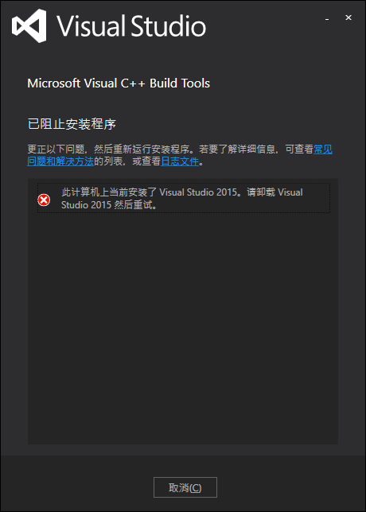

Install Visual C++ Build Tools
===============================

下载Visual C++ Build Tools
--------------------------
地址：http://landinghub.visualstudio.com/visual-cpp-build-tools
描述：
>These tools allow you to build C++ libraries and applications targeting Windows desktop. They are the same tools that you find in Visual Studio 2015 in a scriptable standalone installer. Now you only need to download the tools you need to build C++ projects.

>The Visual C++ Build Tools download is refreshed to include every Visual Studio update. Visual Studio updates won't install on top of the Visual C++ Build Tools installation.

下载下来是一个在线安装程序`visualcppbuildtools_full.exe`，大小3.13MB

首次运行visualcppbuildtools_full.exe
----------------------------
运行之后出现提示，需要卸载掉已经安装的Visual Studio 2015
